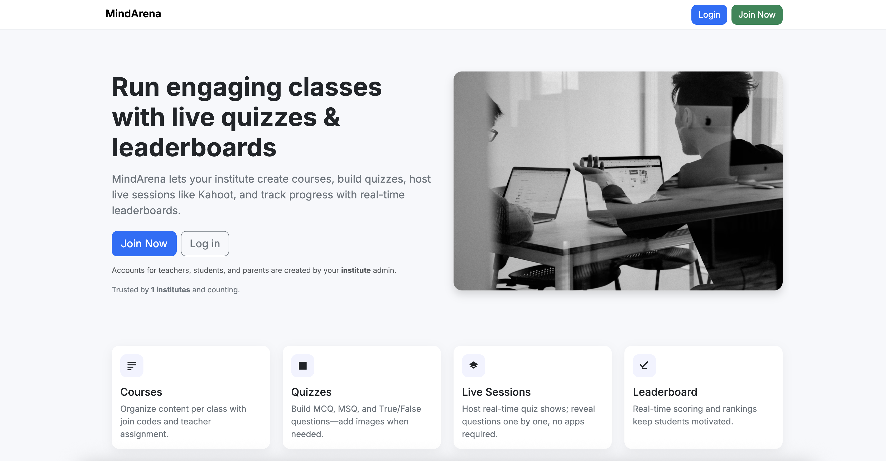

# MindArena



Real-time quiz & live-session platform built with **Django 5** and **Channels**.

## Features
- Role-based orgs (Admin/Manager/Teacher/Student/Parents)
- Courses, quizzes, and live sessions with lobby/admit & leaderboard
- Course page auto-updates sessions (create/start/end) via WebSockets
- Join by code; live play for students; host controls question flow

## Tech Stack
- Django 5, Django Channels
- ASGI: Daphne
- Bootstrap templates
- Postgres (prod), Redis

## Project Layout (from attached package)
```
mindarena/
├── main_app/
│   ├── management/
│   │   └── commands/
│   │       └── ga_demo.py
│   ├── templates/
│   │   ├── main_app/
│   │   │   ├── course_confirm_delete.html
│   │   │   ├── course_detail.html
│   │   │   ├── course_form.html
│   │   │   ├── course_join.html
│   │   │   ├── course_list.html
│   │   │   ├── dashboard.html
│   │   │   ├── dashboard_empty.html
│   │   │   ├── join.html
│   │   │   ├── livesession_answers.html
│   │   │   ├── livesession_detail.html
│   │   │   ├── livesession_form.html
│   │   │   ├── livesession_list.html
│   │   │   ├── organization_confirm_delete.html
│   │   │   ├── organization_form.html
│   │   │   ├── organization_list.html
│   │   │   ├── orgmember_confirm_delete.html
│   │   │   ├── orgmember_edit.html
│   │   │   ├── orgmember_form.html
│   │   │   ├── play.html
│   │   │   ├── quiz_confirm_delete.html
│   │   │   ├── quiz_detail.html
│   │   │   ├── quiz_form.html
│   │   │   ├── quiz_form_edit.html
│   │   │   ├── quiz_list.html
│   │   │   ├── quiz_question_confirm_delete.html
│   │   │   ├── quiz_question_form.html
│   │   │   └── quiz_questions.html
│   │   ├── partials/
│   │   │   └── _navbar.html
│   │   ├── registration/
│   │   │   ├── join_organization.html
│   │   │   ├── login.html
│   │   │   └── signup.html
│   │   ├── base.html
│   │   └── home.html
│   ├── templatetags/
│   │   └── permissions_tags.py
│   ├── __init__.py
│   ├── admin.py
│   ├── apps.py
│   ├── constants.py
│   ├── consumers.py
│   ├── forms.py
│   ├── models.py
│   ├── permissions.py
│   ├── routing.py
│   ├── tests.py
│   ├── urls.py
│   └── views.py
├── mindarena/
│   ├── asgi.py
│   ├── settings.py
│   ├── urls.py
│   └── wsgi.py
├── .env
├── .gitignore
├── manage.py
└── README.md
```

> If you move files, update import paths and Channels routing accordingly.

## ⚙️ Configuration

Create a .env (or set env vars) with at least:

```ini
# Django
DJANGO_SECRET_KEY=[Write yout key]
DJANGO_DEBUG=1

# Database
DB_NAME=[Write your DB name]
DB_USER=postgres
DB_PASSWORD=postgres
DB_HOST=localhost
DB_PORT=5432

# Channels / Redis
REDIS_URL=redis://localhost:6379/0
```

Your settings.py should read these and set CHANNEL_LAYERS accordingly, e.g.:

```python
CHANNEL_LAYERS = {
    "default": {
        "BACKEND": "channels_redis.core.RedisChannelLayer",
        "CONFIG": {"hosts": [os.environ.get("REDIS_URL", "redis://127.0.0.1:6379/0")]},
    }
}
```

## Key Apps / Modules
- `main_app/` — models, views, consumers, permissions
- `templates/main_app/` — HTML templates (dashboard, courses, quizzes, live)
- `mindarena/asgi.py` — Channels ASGI entry
- `routing.py` — WebSocket URL routes
- `urls.py` — HTTP routes

## WebSocket Endpoints
- `/ws/courses/<course_id>/` — broadcast course’s sessions list updates
- `/ws/live/<session_id>/` — lobby/participants/leaderboard + host controls

### Course group messages (`course_<course_id>`)
```json
{ "type": "update", "op": "create|update|remove", "session": { "...": "..." } }
```

### Live group messages (`live_<session_id>`)
```json
{ "type": "snapshot|update|event", "...": "..." }
```

## Local Development
```bash
python -m venv .venv && source .venv/bin/activate  # Windows: .venv\Scripts\activate
pip install -r requirements.txt
python manage.py makemigrations
python manage.py migrate
python manage.py ga_demo
python manage.py runserver
# or: daphne -p 8000 mindarena.asgi:application
```

## Seeding Sample Data
- Use `django-admin shell` or a custom `seed_demo.py` script to create orgs, a teacher, a course, quizzes, and a demo session.

## Online Demo
[Click Here]('https://mindarena.onrender.com/')

## 📡 Realtime Flows

- Course detail page subscribes to course_{course_id}:
    - op=create → add a new session row
    - op=update → update started_at (on start)
    - op=remove → remove row (on end)
- Live session page subscribes to live_{session_id}:
    - join_lobby/admit/start/next/end dispatch updates
    - eaderboard broadcast on end
    - Answer submissions ack’d individually


# 🧑‍🏫 Seed / Demo Data

Two options:
1. UI: Log in as spk and create an Organization → Teacher → Course → Quizzes (3–4 Q each) → Live Session.
2. Management command (suggested to add):
    - Implement python manage.py seed_demo_mindarena
        - Creates an org, a teacher, a demo course, several quizzes with mixed MCQ/MSQ/TF on GA/SE topics, and attaches placeholder images.

After adding it, run:

```bash
python manage.py seed_demo_mindarena
``` 

## 🔐 Access Control (summary)

- Superuser: global access
- Admin/Manager: org-scoped management (courses/quizzes/live)
- Teacher: their courses/quizzes/sessions
- Student/Parents: enrolled courses, can join sessions in same org

Guarded through allowed(user, action, resource, org=…) checks in views/consumers.

## References
[Trello Board]('https://trello.com/invite/b/68bf146cea791ad4cf9c4cb0/ATTI67172a28cb038d2e8d0749263579e6c7C7321130/mind-arena')
